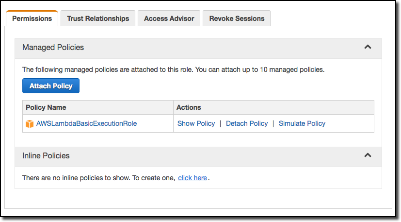
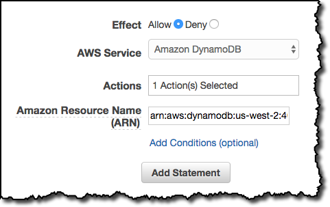

# AWS Lambda

In this module you will create Lambda function to process your backend logic.


## Implementation Instructions
Each of the following sections provide an implementation overview and detailed, step-by-step instructions. The overview should provide enough context for you to complete the implementation if you're already familiar with the AWS Management Console or you want to explore the services yourself without following a walkthrough.


### 1. Login to AWS Console
1. Go to your AWS Console

2. Login as IAM user which have enough privilege

3. Select AWS region: **N. Virginia**

### 2. Create IAM Role for AWS Lambda Execution
Use the IAM console to create a new role. You'll need to attach policies that grant your function permissions to write to Amazon CloudWatch Logs and put items to your DynamoDB table.

1. From the AWS Management Console, click on **Services** and then select **Identity & Access Management** in the Security, Identity & Compliance section.

1. Select **Roles** in the left navigation bar and then choose **Create New Role**.

1. Select role type:
  1. Make sure **AWS Service Role** is selected
  1. Choose **AWS Lambda**, and click **Select**

1. Begin typing `AWSLambdaBasicExecutionRole` in the Filter text box and check the box next to that role.

1. Click **Next Step**

1. Enter `lambda-supermission-role` for the **Role Name**.

1. Click **Create role**

1. Type `lambda-supermission-role` into the filter box on the Roles page and choose the role you just created.

1. On the Permissions tab, expand the **Inline Policies** section and choose the **click here** link to create a new inline policy. As shown below:  

   
1. Ensure that **Policy Generator** is selected and choose **Select**.

1. Ensure that `Allow` is selected in **Effect**

1. Select **Amazon DynamoDB** from the **AWS Service** dropdown.

1. Select **All Actions** from the Actions list. 

1. Paste the ARN of the table you created in the previous section in the **Amazon Resource Name (ARN)** field.  


1. Choose **Add Statement**

1. Choose **Next Step**, review **Policy Document** then click **Apply Policy** 


### 3. Create Lambda Function - GetHeroesList

1. From the AWS Management Console, click on **Services** and then select **Lambda** in Compute section.

1. Click **Create a Lambda Function**

1. Choose the **Blank Function** blueprint card.

1. Don't add any triggers at this time. Choose **Next** to proceed to defining your function.

1. Enter `GetHeroesList` in the Name field.

1. Optionally enter a **description**.

1. Select **Node.js 6.10** for the Runtime.

1. Copy and paste the code from [getHeroesList.js](getHeroesList.js) into the code entry area.

1. Leave the default of `index.handler` for the **Handler** field.

1. For **Role**, click **Choose an existing role**

1. Select `lambda-supermission-role` from the **Existing Role dropdown**.

1. In the Advanced Settings section, all values canbe left at their defaults.

1. Choose **Next** and then choose **Create function** on the Review page.

1. From the **Actions** menu in the Lambda console, click **Configure test event**

1. For **Sample event template** click **Hello World**

1. Click **Save and Test**

1. You will see a message telling you that **Execution Result: Succeeded.** You will see a text box displaying contents of the SuperMission DynamoDB table.


### 4. Create Lambda Function - GetMissionDetails

1. Click **Function** at left side menu

1. Click **Create a Lambda Function**

1. Choose the **Blank Function** blueprint card.

1. Don't add any triggers at this time. Choose **Next** to proceed to defining your function.

1. Enter `GetMissionDetails` in the Name field.

1. Optionally enter a **description**.

1. Select **Node.js 6.10** for the Runtime.

1. Copy and paste the code from [getMissionDetails.js](getMissionDetails.js) into the code entry area.

1. Leave the default of `index.handler` for the **Handler** field.

1. For **Role**, click **Choose an existing role**

1. Select `lambda-supermission-role` from the **Existing Role dropdown**.

1. In the Advanced Settings section, all values canbe left at their defaults.

1. Choose **Next** and then choose **Create function** on the Review page.

1. From the **Actions** menu in the Lambda console, click **Configure test event**

1. For **Sample event template** click **Hello World**

1. In the editor, remove all of the placeholder code

1. Copy the code below, and paste it into the editor. This code will look for details of Batman's mission in the DynamoDB table.   
```
{"superhero": "Batman"}
```

18. You will see a message telling you that **Execution Result: Succeeded.** You will see a text box displaying mission details for Batman.