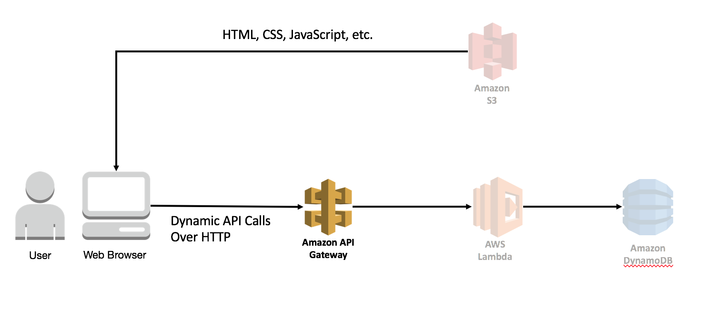

# Amazon API Gateway

In this module you'll use API Gateway to expose the Lambda function you built in the previous module as a RESTful API. 

## Implementation Instructions
Each of the following sections provide an implementation overview and detailed, step-by-step instructions. The overview should provide enough context for you to complete the implementation if you're already familiar with the AWS Management Console or you want to explore the services yourself without following a walkthrough.

### 1. Login to AWS Console
1. Go to your AWS Console

2. Login as IAM user which have enough privilege

3. Select AWS region: **N. Virginia**

### 2. Create a New REST API

1. In the AWS Management Console, click **Services** then select **API Gateway** under Application Services.

1. Choose **Create API**.

1. Select **New API** and enter `SuperHeroes` for the API Name.

1. Choose **Create API**

### 3. Create a new resource and method

1. In the left navigation, click on **Resources** under your SuperHeroes API.

1. Click / (the root of the folder you're looking at)

1. From the **Actions** dropdown select **Create Resource**.

1. For **Resource Name**, type `getheroeslist`

1. For **Resource Path**, type `getheroeslist` (this path may be auto-populated for you)

1. Click **Create Resource**

1. Now you will create another child resource.

1. Click / (again, the root folder)

1. Click **Actions**, then click **Create Resource**

1. For **Resource Name**, type `getmissiondetails`

1. For **Resource Path**, type `getmissiondetails` (this path may be auto-populated for you)

1. Click **Create Resource**

### 4. Lambda Function Integration

Create a new resource within your API. Then create a POST method for that resource and configure it to use a Lambda integration backed by the Lambda function you created in the first step of this module.

1. Click the **getheroeslist** resource

1. With the **getheroeslist** resource selected, click **Actions**, then click **Create Method**

1. You will see a dropdown menu. Click **Post**. Then click the **check mark**

1. Now you will setup your method. For **Integration type**, click **Lambda Function**

1. For **Lambda Region**, choose your working region (ex. **us-east-1**)

1. For **Lambda Function**, select `GetHeroesList`

1. Click **Save**

1. You will see a warning that you are about to give the API Gateway service permission to invoke your lambda function. Click **OK**.

1. Click the **getmissiondetails** resource.

1. With the **getmissiondetails** resource selected, click **Actions**, then click **Create Method**

1. You will see a dropdown menu. Click **Post**. Then click the **check mark**

1. Now you will setup your method. For **Integration type**, click **Lambda Function**

1. For **Lambda Region**, choose your working region (ex. **us-east-1**)

1. For **Lambda Function**, select `GetMissionDetails`

1. Click **Save**

1. You will see the same warning. Click **OK**.

### 5. Enable CORS

You will enable CORS for methods you just created in API Gateway. CORS (Cross-Origin Resource Sharing) allows browsers to make HTTP requests to servers with a different domain/origin. 

For simplicity, you can set the Access-Control-Allow-Origin header value to '*', but in a production application you should always explicitly whitelist authorized domains to mitigate [cross-site request forgery (CSRF)](https://www.owasp.org/index.php/Cross-Site_Request_Forgery_%28CSRF%29) attacks.

For more information about CORS configurations in general, see [https://developer.mozilla.org/en-US/docs/Web/HTTP/Access_control_CORS](https://developer.mozilla.org/en-US/docs/Web/HTTP/Access_control_CORS)

1. Click the `getheroeslist` resource

1. With the `getheroeslist` resource selected, click **Actions**, then click **Enable CORS**

1. Make sure both methods, **Post** and **Options** are selected.

1. Click **Enable CORS and replace existing CORS headers**.

1. Confirm that you want to **Yes, replace existing values**.

1. Use the same process to enable CORS, using exactly the same settings for **getmissiondetails** resource.

### 6. Deploy API

1. Click the root folder /

1. Click **Actions**, then click **Deploy API**.

1. For **Deployment Stage**, select **New Stage**.

1. Enter `prod` for the stage name.

1. Click **Deploy**

1. Note the **Invoke URL**. You will use it in the next section.

### 7. Test API

- You can use browser plugin to test RESTful Webservice in API Gateway

- If you don't have any RESTful API client, you can download and install one   
  - Firefox: [RESTClient](https://addons.mozilla.org/en-US/firefox/addon/restclient/)   
  - Chrome: [Advanced REST client](https://chrome.google.com/webstore/detail/advanced-rest-client/hgmloofddffdnphfgcellkdfbfbjeloo) or [Postman](https://chrome.google.com/webstore/detail/postman/fhbjgbiflinjbdggehcddcbncdddomop)

- Test **getheroeslist** API
  - Method: **POST**   
  - URL: Your API Gateway **Invoke URL** with **getheroeslist** (ex. https://zxxxxxxxxx.execute-api.us-east-1.amazonaws.com/prod/getheroeslist)   
  - Invoke the URL   
  - You will expect **200** HTTP response code with list of superheroes in the **response body**

- Test **getmissiondetails** API   
   - Method: **POST**   
   - URL: Your API Gateway **Invoke URL** with **getmissiondetails** (ex. https://zxxxxxxxxx.execute-api.us-east-1.amazonaws.com/prod/getmissiondetails)   
   - Request Body: `{"superhero": "Superman"}`
   - Invoke the URL
   - You will expect **200** HTTP response code with detail information of related superhero in the **response body**