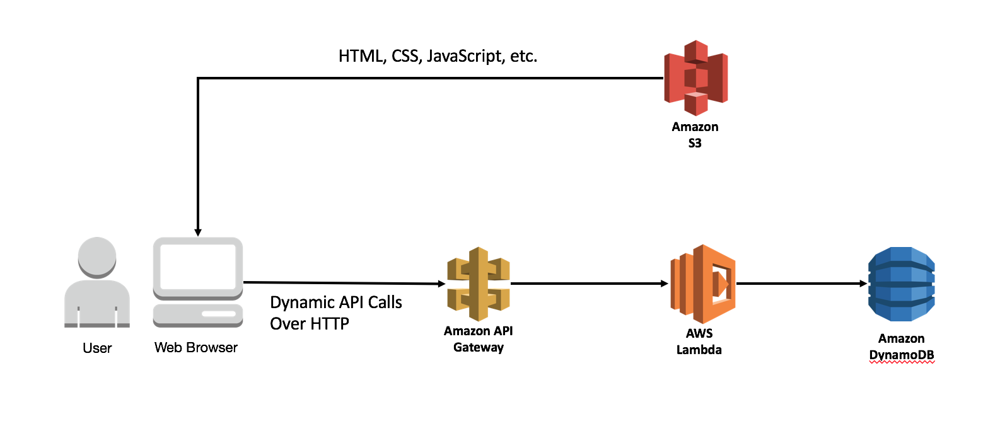

# Amazon S3

In this module you'll configure Amazon Simple Storage Service (S3) to host the static resources for your web application. 



## Implementation Instructions
Each of the following sections provide an implementation overview and detailed, step-by-step instructions. The overview should provide enough context for you to complete the implementation if you're already familiar with the AWS Management Console or you want to explore the services yourself without following a walkthrough.


### 1. Login to AWS Console
1. Go to your AWS Console

2. Login as IAM user which have enough privilege

3. Select AWS region: **N. Virginia**

### 2. Generate the SDK for your API

1. Go to **API Gateway** console

1. Click **SuperHeroes** API from the left pane

1. Click **Stages**, and choose **prod**

1. Click **SDK Generation** tab

1. For **Platform**, click **Javascript**

1. Click **Generate SDK**. You will automatically download a ZIP

1. Open the directory (your Downloads folder) and extract the contents of the ZIP to your local computer

1. Next, you will retrieve an HTML page that you will use to test your API. Go to [index.html](index.html)

1. Copy the content, save it as  **index.html** to your local computer previously extracted **apiGateway-js sdk** folder

1. Open **index.html** in your browser

1. Using the index web page, retrieve mission details. Review the output.

### 3. Integrate with S3 Static Website

- On the **Services** menu, click **S3**

- Click **Create Bucket** 

- Type a bucket name. Note that your bucket name must be unique. 

- For **Region**, click **US East (N.Virginia)**

- On **Set Properties**, Click **Next**

- On **Set permissions**, Click **Next**

- On **Review**, Click **Next**

- Click **Create Bucket**

- Click your bucket to open it

- Click **Permissions** tab

- Click **Bucket Policy**

- Enter the following policy document into the bucket policy editor replacing YOUR\_BUCKET_NAME with the name of the bucket you created:

```
{   
    "Version": "2012-10-17",   
    "Statement": [   
        {   
            "Effect": "Allow",   
            "Principal": "*",   
            "Action": "s3:GetObject",   
            "Resource": "arn:aws:s3:::YOUR_BUCKET_NAME/*"   
        }   
    ]   
}   
```

- Click **Save**

- Click **Properties** tab

- Choose **Static website hosting**

- Choose **Use this bucket to host a website**

- Take a note of **Endpoint** URL (ex. http://mybucket.s3-website-us-east-1.amazonaws.com)

- On Index Document, type **index.html**   


- Click **Save**

- Click **Objects** tab

- Click **Upload** (at the top left)

- Click **Add files**

- Open the **apiGateway-js-sdk** folder where you saved the Javascript SDK and index.html

- Upload all files (including subfolder) to S3 bucket. Note that you might need to create subfolder separately in S3 console. You also might consider using:
	- FTP client (ex. cyberduck, cloudberry, crossftp) 
	- AWS CLI 

- After you completed the upload, open a new browser tab/window.

- Navigate to the **Endpoint** URL that you copied at previous step.
`http://<my-unique-bucket-name>.s3-website-us-east-1.amazonaws.com`

- You can now hosting website in S3 to look up data stored in your DynamoDB database using API Gateway and Lambda function.